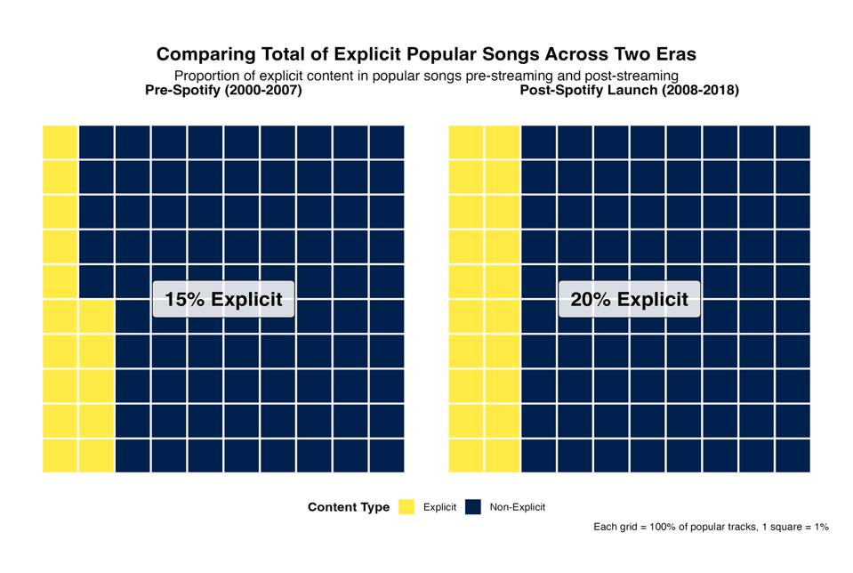
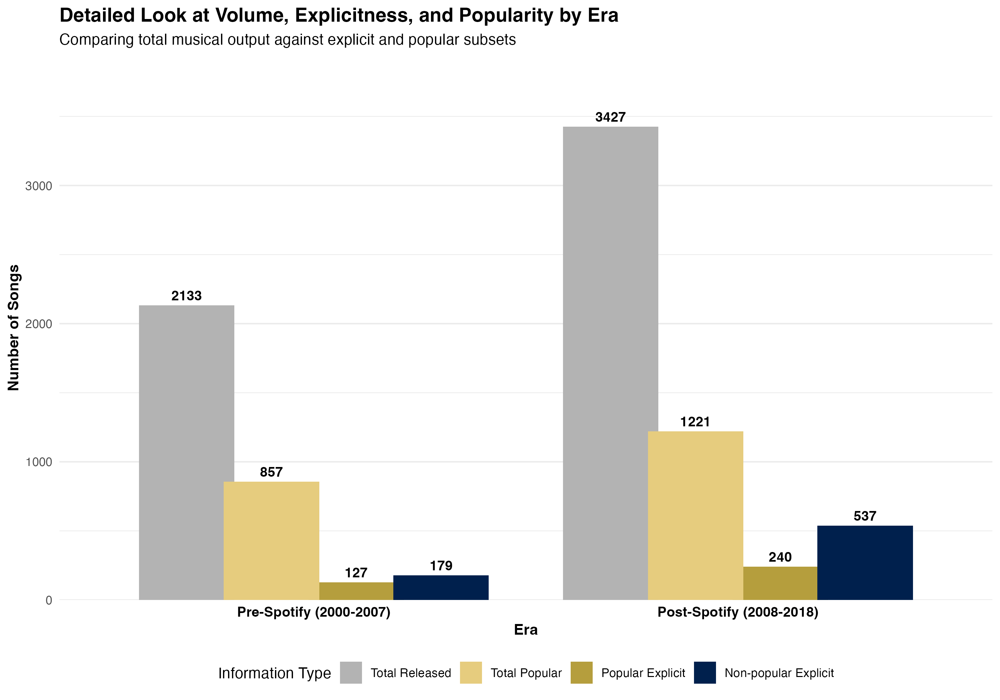
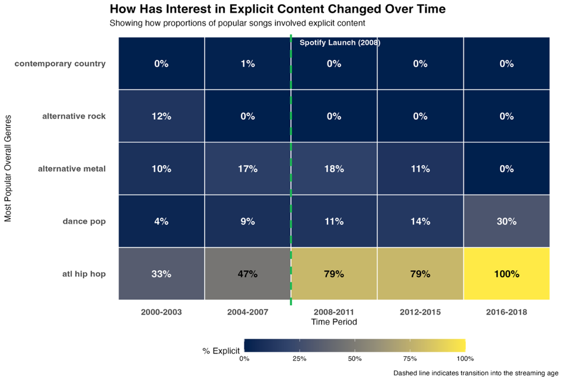
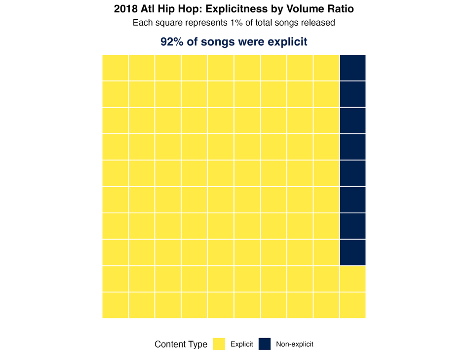
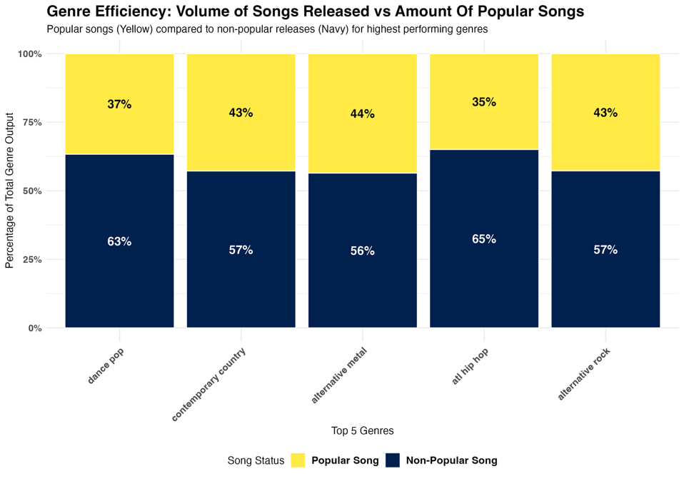
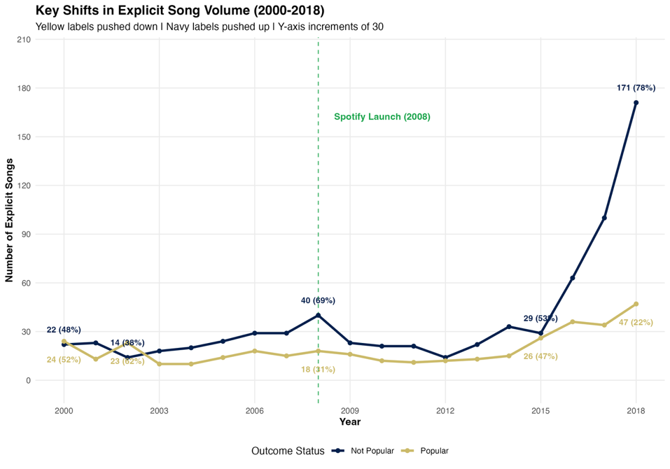

# The Spotify Effect: Genre and Explicit Content Trends in the Streaming Age

MSc Data Science coursework (University of Sheffield), Grade: 65 (Merit). A 6-chart data visualisation composite exploring whether the proportion of explicit content in popular music changed after Spotify's 2008 launch, and which genres were behind that shift, built from the MusicOSet dataset (20,405 songs; 5,560 songs from 2000-2018 in the era totals below).

> **Reproducibility note:** the underlying MusicOSet CSVs aren't included in this repo (see Data, below), so `spotify_genre_explicit_viz.Rmd` can't be rerun end-to-end from this repo alone. 5 of the 6 figures below are the final chart images from my write-up; the 6th (the grouped bar chart) is a higher-resolution export of the same code's output. Numbers in this README were checked against these images and my write-up, not recomputed, since the raw data is not available to rerun.

## Key results

**Did explicit content increase after Spotify's 2008 launch?** Yes, modestly overall: **15% of popular songs were explicit pre-Spotify (2000-2007) vs. 20% post-Spotify (2008-2018)**, a 5 percentage point increase.



That 15%/20% split is against a backdrop of rapidly growing overall output: total songs in the dataset grew from 2,133 (pre-Spotify) to 3,427 (post-Spotify), and total popular songs from 857 to 1,221. Within that growth, explicit-and-popular songs grew from 127 to 240, while explicit-but-not-popular songs grew far faster, from 179 to 537. These totals are exactly the sums of the year-by-year line chart further down (127 and 179 are the exact sums of the "Popular" and "Not Popular" series for 2000-2007; 240 and 537 for 2008-2018), so the two charts are consistent with each other.



**Which genres were behind the shift?** Mostly `atl hip hop`, with `dance pop` also rising. Across the top 5 genres by popular-song volume, contemporary country stayed at 0-1% explicit throughout and alternative rock and alternative metal fluctuated in the 0-18% range, but ATL hip hop climbed from 33% (2000-2003) to 100% (2016-2018) and dance pop rose steadily from 4% to 30%. ATL hip hop's rise was the largest and earliest (33% to 79% by 2008-2011), so it is the clearest driver, but the top-5 heatmap cannot show how much each genre contributed to the overall 15% to 20% change.



**Case study, ATL hip hop in 2018 specifically:** 92% of all ATL hip hop songs in the dataset from that single year (popular and not popular) were explicit. This is a different measure from the heatmap's "100%", which is the share of *popular* ATL hip hop songs across the whole 2016-2018 bin; see Verification note.



**Which genres convert output into hits most efficiently?** Among the top 5 genres by popular-song volume, alternative metal has the highest hit rate (44% of the genre's songs in the dataset are labelled popular), narrowly ahead of contemporary country (43%) and alternative rock (43%). ATL hip hop, despite dominating the explicit-content story, has the *lowest* hit rate of the five (35%): it produces a large volume of popular songs through the sheer number of songs, not an unusually high hit rate.



**How did raw volume change over time?** My write-up flags the line chart as the main interpretive risk: non-popular explicit songs explode from 29 (2015) to 171 (2018), a volume increase so large it can make explicit content look like it's "winning" even though the *popular* explicit count only grows from 26 to 47 in the same window. My ethical-implications section calls this out: read on volume alone, this chart risks implying the streaming transition had minimal effect on what became popular, whereas the other charts show the explicit share of popular songs rising over the same period.



## Methods & tools

- **Language:** R (R Markdown), `ggplot2`, `tidyverse`
- **Data:** MusicOSet (Silva et al., 2019), 4 subsets (songs, artists, acoustic features, popularity) merged via `left_join`, filtered to 2000-2018; "popular" (is_pop) is MusicOSet's Billboard-based label: songs whose year-end chart score (from peak position and weeks on the Hot 100) is above that year's average are labelled popular, and the lowest scorers are not (Silva et al., 2019)
- **Chart types:** waffle charts (`geom_tile` on an `expand.grid` waffle layout, `facet_wrap` for side-by-side era comparison), a heatmap (`geom_tile` with `geom_text` percentage labels), a 100% stacked bar chart, a time series with direct data labels
- **Design framework:** built and justified using the ASSERT framework (Ferster, 2013), my write-up documents Ask/Search/Structure/Envision/Represent/Tell for each chart, plus a dedicated accessibility section (colour-blind-safe `cividis` palette, high-contrast text labels, sans-serif Arial font chosen for readability.

## Repo structure

```
spotify-explicit-genre-trends/
├── README.md                        ← you are here
├── spotify_genre_explicit_viz.Rmd  ← full visualisation code
└── figures/
    ├── explicit_content_waffle_pre_post_spotify.png
    ├── volume_explicit_popularity_by_era_bar.png
    ├── explicit_content_heatmap_top5_genres.png
    ├── atl_hiphop_2018_case_study_waffle.png
    ├── hit_to_release_ratio_stacked_bar.png
    └── explicit_song_volume_timeseries.png
```

## How to run

1. Install R and the packages the script loads at the top (`tidyverse`, `ggplot2`, `dplyr`).
2. The script expects 4 pre-cleaned CSVs (`songs cleaned converted copy.csv`, `artists for vis cleaned.csv`, `acoustic features cleaned converted copy.csv`, `song ispop cleaned converted copy.csv`) that aren't included in this repo; see Data, below.
3. Run top to bottom; the script merges the 4 sources, filters to 2000-2018, then produces all 6 chart blocks in sequence, matching all 6 figures in this README.

## Data

MusicOSet (Silva et al., 2019) is a public dataset, but the pre-cleaned CSVs this script reads are not redistributed here. The 6 figures in this repo are the actual final chart images (5 from my write-up, 1 a separate export), standing in for a live rerun.

## Limitations

- I could not rerun the code, so the numbers were checked against the chart images and my write-up, not recomputed from source data.
- My write-up quotes 6,662 song entries after filtering to 2000-2018, but the era totals in the grouped bar chart add up to 5,560 (2,133 + 3,427). I could not reconcile these without rerunning the code, so this README uses the chart totals.
- The line chart (last figure above) is risky to read on its own, since raw-count growth in non-popular explicit songs can visually overwhelm the smaller but real growth in popular explicit songs (flagged in my write-up).
- The comparison around Spotify's 2008 launch is before-and-after, so it shows correlation, not causation. The dashed launch line and the title ("The Spotify Effect") should not be read as evidence that Spotify caused the change (flagged in my write-up).
- MusicOSet is built from Billboard chart data and Spotify metadata, so it covers mainstream, US-centred music and under-represents independent and non-Western music (also noted in my write-up). "Hit rate" therefore means the share of songs in the dataset labelled popular, not of all songs released.
- The charts are static images with no alt text, and yellow is used for both "explicit" and "popular" in different charts (both flagged in my write-up).
- The heatmap groups years into bins (2000-2003, 2004-2007, 2008-2011, 2012-2015, 2016-2018) and covers popular songs only, so its "100%" for ATL hip hop (2016-2018, popular songs) and the case study's "92%" (2018, all songs) measure different things; see Verification note.
  
## Verification note

My write-up states that "by 2018, 100% of popular songs in the ATL hip-hop genre featured explicit content," citing the heatmap. The heatmap does show 100%, but for the **2016-2018 bin as a whole** and for **popular songs only**. The 2018 case-study chart (**92%**) covers all ATL hip hop songs from 2018, popular and not popular (the code filters on year and genre only, not on popularity). So the two figures differ in both period and population, and the write-up's wording ("by 2018") reads as if they were the same measure. This README reports both and labels which is which.

Separately, the grouped bar chart's totals (127/179 explicit-popular/explicit-non-popular pre-Spotify, 240/537 post-Spotify) match the sums of the corresponding year-by-year values in the line chart. Both charts are built from the same dataset, so this checks that the code is consistent, not the data itself.
